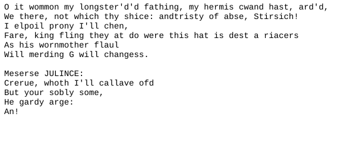

# nanoGPT

A small PyTorch implementation of a GPT-style language model, inspired by Andrej Karpathy's nanoGPT and educational transformer walkthroughs.

The repo contains a compact transformer model, a simple tokenizer/data loader, a YAML config, and a notebook for training and generating text.

## Dataset

The model trains on `data/input.txt`, a tiny Shakespeare-style text corpus with play dialogue.

## Sample

Generated imitation of Shakespeare-like text after training:



## Run

Install the main dependencies:

```bash
pip install torch pyyaml jupyter
```

Then open the notebook:

```bash
jupyter notebook nano-gpt.ipynb
```

Adjust hyperparameters in `config/config.yaml`, run the notebook cells, and inspect the generated sample text at the end.

## Credit

The idea and learning path come from Andrej Karpathy's work on small GPT implementations, especially nanoGPT.
